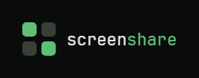

<p align="center">
  
</p>

<p align="center"><strong>Compartilhamento de tela nativo, leve e privado para grupos pequenos no Windows.</strong></p>

<p align="center">
  <a href="https://github.com/Ruthraas/Screen-Share/releases/latest"></a>
  <a href="https://github.com/Ruthraas/Screen-Share/actions/workflows/backend-ci.yml"></a>
  <a href="https://github.com/Ruthraas/Screen-Share/actions/workflows/frontend-ci.yml"></a>
  <a href="LICENSE"></a>
  <a href="https://github.com/Ruthraas/Screen-Share/releases/latest"></a>
</p>

O ScreenShare nasceu de uma ideia simples: compartilhar a tela com um grupo
pequeno (família, amigos, um time) não deveria exigir Discord, Zoom ou
qualquer plataforma de terceiros rodando por trás. É um app de desktop pra
Windows que captura sua tela nativamente, manda direto pra quem está no
grupo com você via WebRTC, e para por aí. Sem chat de voz, sem microfone,
sem nada além do que o produto realmente precisa fazer.

## O que ele faz

Você cria uma conta (e-mail e senha, ou entra direto com Google, GitHub ou
Discord), cria ou entra num grupo por convite, e pronto: já dá pra
compartilhar. A captura é 100% nativa, sem passar pelo navegador, com
seletor de monitor ou janela e escolha de qualidade e fps. Se quiser, o
áudio do sistema (o som de um jogo, de um vídeo) vai junto, sempre por
escolha de quem está compartilhando. Quem está assistindo vê a transmissão
em destaque, com controle de volume e tela cheia, e consegue trocar entre
quem estiver transmitindo na hora. O app também se atualiza sozinho: baixa,
verifica a assinatura e instala a versão nova sem você precisar fazer nada.

## Instalar

Pega o instalador mais recente na página de
[**Releases**](https://github.com/Ruthraas/Screen-Share/releases/latest)
(`ScreenShare_<versão>_x64-setup.exe`). Precisa de Windows 10 ou 11 x64 com
WebView2, que já vem instalado em qualquer Windows atualizado.

## Como é feito por dentro

O cliente é React e TypeScript rodando dentro de um Tauri 2, com a parte
nativa (captura de tela, áudio do sistema) em Rust puro. O backend é
separado, Node com Fastify, cuida de autenticação, grupos e convites,
sinalização WebSocket pra abrir as conexões WebRTC e emissão de credenciais
TURN. O banco é Turso.

```text
React + TypeScript + Tauri 2 (Rust)  →  ScreenShare.exe (Windows x64)
   captura nativa (Windows Graphics Capture) + áudio (WASAPI)
   WebRTC direto entre participantes, sinalização via backend

Backend Node.js + Fastify, hospedado à parte
   auth própria · grupos e convites · sinalização WebSocket · credenciais TURN
   banco: Turso (libSQL)
```

O frontend/desktop e o backend têm donos e escopos diferentes. Os detalhes
estão em [`CONTRIBUTING.md`](CONTRIBUTING.md), e a arquitetura de cada lado
em [`docs/FRONTEND.md`](docs/FRONTEND.md) e
[`docs/backend/ARQUITETURA.md`](docs/backend/ARQUITETURA.md).

## Rodando localmente

```powershell
npm ci
npm run tauri:dev
```

Isso sobe só o cliente. Pra login e grupos funcionarem de verdade, o
backend precisa estar rodando à parte (veja o `README`/`.env.example` dentro
de `backend/`). O passo a passo completo de build, testes e empacotamento
está em [`docs/FRONTEND.md`](docs/FRONTEND.md).

## Contribuindo

Issues e pull requests são bem-vindos. Ninguém, nem os próprios
mantenedores, commita direto na `main`: toda mudança entra por pull
request, revisada, e só é mergeada com os testes automatizados passando
(são os badges de CI lá em cima). Antes de abrir um PR, dá uma lida no
[`CONTRIBUTING.md`](CONTRIBUTING.md), ele explica o fluxo de trabalho, onde
fica a fronteira entre frontend e backend, e o que esperamos de um PR pra
aceitar.

## Créditos

Mantido por **[@Ruthraas](https://github.com/Ruthraas)**, cuidando do
frontend, do cliente desktop, da captura nativa e da interface, e por
**[@ProgVictorPe](https://github.com/ProgVictorPe)**, responsável por todo o
backend: autenticação, sinalização, infraestrutura e hospedagem. O
ScreenShare simplesmente não existiria no ar sem o trabalho dele.

## Licença

Este projeto está sob a [GPL-3.0](LICENSE). Qualquer um pode usar, estudar,
modificar e redistribuir o código, desde que qualquer trabalho derivado
continue sob a mesma licença.
