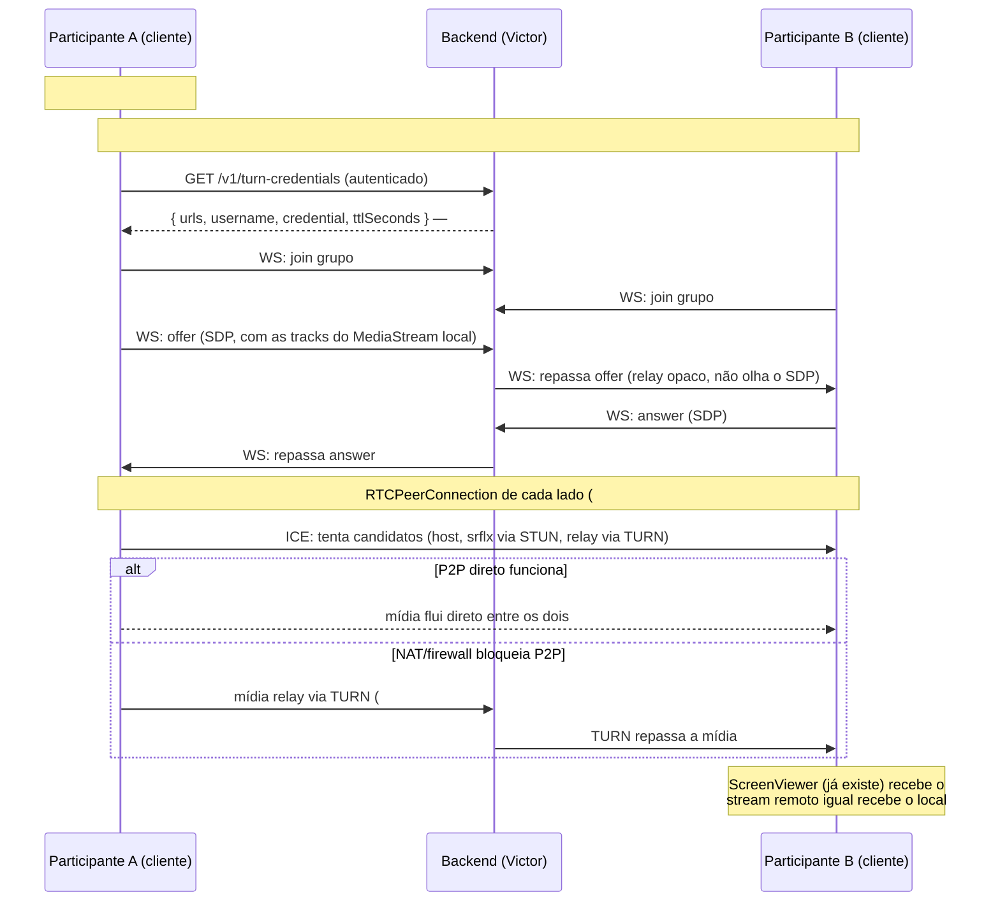

# Plano: WebRTC + TURN (issue #71)

Documento de arquitetura registrando o caminho combinado pra ligar a captura
de tela (#8, já pronta) a uma transmissão real entre participantes via
WebRTC, usando TURN como estratégia de travessia de NAT (decisão já aprovada,
issues #40/#41 do backend). Não muda quem faz frontend ou backend — só deixa
o encaixe entre as peças explícito, porque a #71 depende de três issues do
Victor (#9, #40, #41) e o inverso também é verdade (o formato exato que o
`RTCPeerConnection` do cliente espera importa pro que o backend expõe).

## Por que captura de tela (WGC) e WebRTC são coisas diferentes

Confusão comum: "já que a #8 usa Windows Graphics Capture, isso tem a ver
com WebRTC?" — não tem, são duas etapas sequenciais e independentes:

- **Captura (#8, pronta)**: WGC pega os pixels da tela e produz um
  `MediaStream` real, 100% local — sem rede, sem WebRTC, sem ICE, sem TURN.
  O resultado é só um objeto `MediaStream` que qualquer coisa no navegador
  sabe consumir (um `<video>`, ou o `RTCPeerConnection` da #71).
- **Transmissão (#71, a fazer)**: WebRTC pega esse `MediaStream` já pronto e
  manda pra outro participante pela rede. Não importa como o stream foi
  criado (WGC, `getDisplayMedia`, webcam) — o `RTCPeerConnection` só precisa
  de tracks (`stream.getTracks()`) pra anexar via `addTrack()`.

TURN entra numa camada **depois** disso: depois que os dois participantes já
trocaram sinalização (quem quer conectar com quem) e o WebRTC já sabe que
tracks existem, ele ainda precisa achar um caminho de rede real entre os dois
computadores — é isso que ICE faz, e TURN é o plano B do ICE quando a conexão
direta P2P não rola.

## O caminho completo, passo a passo



## Quem já faz o quê (sem mudar nada disso)

| Peça | Issue | Dono | Status |
|---|---|---|---|
| Captura local → `MediaStream` | #8 | Frontend | Pronto (aguardando validação ao vivo) |
| Protocolo de sinalização (schema) | #38 | Backend | Fechada |
| Relay de sinalização (`/ws`) | #9 | Backend | **Fechada** (2026-09-13) — critérios de relay validados com teste real, reforçada pela #42 (reconexão/heartbeat) |
| Infra TURN | #40 | Backend | **Decisão revisada (2026-09-14): Cloudflare Realtime TURN** (serviço gerenciado) em vez de coturn autogerenciado — ver `docs/backend/ARQUITETURA.md` |
| Credenciais TURN temporárias | #41 | Backend | Implementado e testado (`POST /v1/turn-credentials`) — pendente só validar a TURN Key real na conta Cloudflare (ver nota abaixo) |
| Teste de capacidade | #47 | Backend | Aberta, depende de #41 estar validado com credencial real + #42/#43 |
| `RTCPeerConnection` do cliente + indicador de ping | #71 | Frontend | Aberta, depende de #8 (pronta) + #9 (pronta) + #41 (implementado, pendente validação da chave) |

## O contrato exato que a #71 precisa do #41 (atualizado 2026-09-14)

`POST /v1/turn-credentials` (autenticado, `docs/backend/openapi.yaml`)
devolve `{ iceServers, ttlSeconds }` — **não** um objeto plano
`{urls, username, credential}` como uma versão anterior deste doc
assumia; é a Cloudflare quem decide esse formato (endpoint
`generate-ice-servers`, confirmado na doc oficial), e ele já bate 1:1 com
`RTCConfiguration.iceServers`:

```ts
const response = await fetch(apiUrl("/v1/turn-credentials"), { headers: authHeader, method: "POST" });
const { iceServers, ttlSeconds } = await response.json();
const peer = new RTCPeerConnection({ iceServers }); // sem transformação nenhuma
```

`iceServers` sempre vem com duas entradas — **resolvido** o que a versão
anterior deste doc deixava em aberto:

```json
[
  { "urls": ["stun:stun.cloudflare.com:3478"] },
  { "urls": ["turn:turn.cloudflare.com:3478?transport=udp", "turns:turn.cloudflare.com:5349?transport=tcp"], "username": "...", "credential": "..." }
]
```

A entrada STUN já vem junto, sem `username`/`credential` (não precisa —
STUN não autentica); a #71 **não precisa adicionar nenhum servidor STUN
externo por conta própria**, nem montar/filtrar a lista — é só passar
`iceServers` direto pro `RTCPeerConnection`.

Ponto de atenção pra quando a #71 for implementada: renovar a credencial
antes do `ttlSeconds` (hoje 3600s) expirar se a chamada demorar, buscando
um novo `/v1/turn-credentials` em vez de reusar uma credencial vencida.

## Nota (2026-09-14): TURN Key precisa ser revalidada na Cloudflare

O backend (`/v1/turn-credentials`) está implementado, testado (`npm test`)
e validado contra a API real da Cloudflare — a chamada chega certinho no
endpoint certo, com o formato certo (confirmado pelo próprio header
`Link: <stun:stun.cloudflare.com:3478>; rel="ice-server"` que a Cloudflare
devolve mesmo em erro). Só que a `TURN_KEY_ID` configurada hoje não
corresponde a uma TURN Key válida na conta — a Cloudflare responde
`{"error":"cannot find specified key"}`. Provavelmente o App ID foi copiado
de uma tela diferente (ex.: Cloudflare Calls/SFU, que também usa "App ID" +
"API Token" mas é um produto diferente do Realtime TURN). Ação: confirmar
no dashboard da Cloudflare em **Realtime → TURN** (não Calls/SFU), criar ou
conferir a TURN Key ali, e atualizar `backend/.env` (`TURN_KEY_ID`/
`TURN_KEY_API_TOKEN`) com os valores dessa tela específica.
