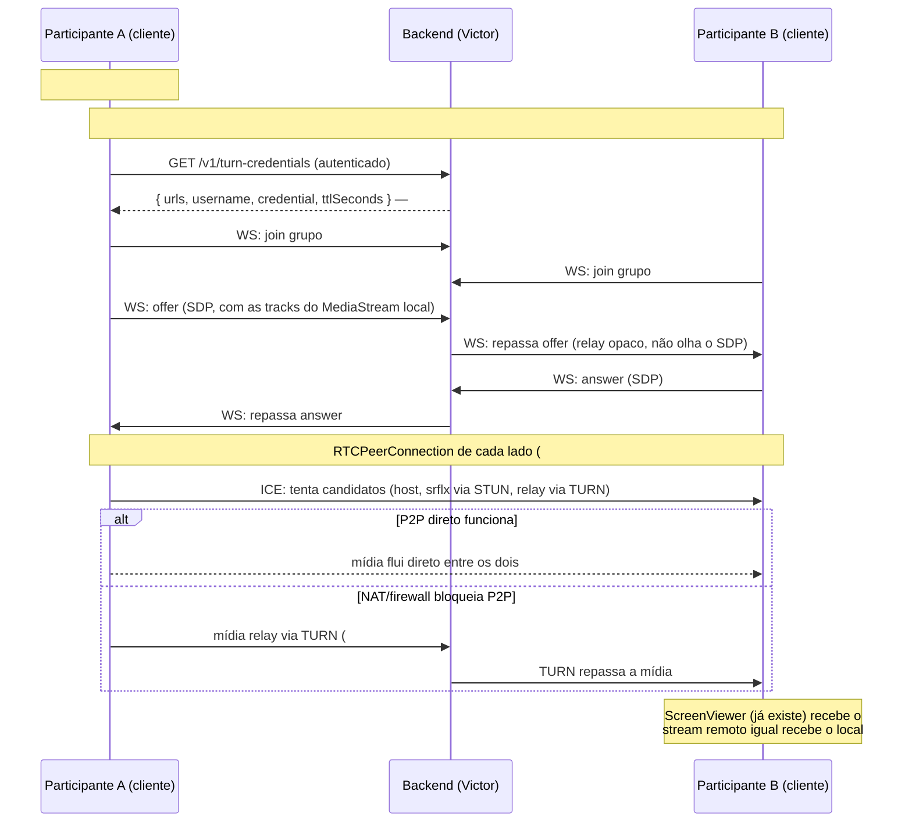

# Plano: WebRTC + TURN (issue #71)

Documento de arquitetura registrando o caminho combinado pra ligar a captura
de tela (#8, já pronta) a uma transmissão real entre participantes via
WebRTC, usando TURN como estratégia de travessia de NAT (decisão já aprovada,
issues #40/#41 do backend). Não muda quem faz frontend ou backend — só deixa
o encaixe entre as peças explícito, porque a #71 depende de três issues do
Victor (#9, #40, #41) e o inverso também é verdade (o formato exato que o
`RTCPeerConnection` do cliente espera importa pro que o backend expõe).

## Por que captura de tela (WGC) e WebRTC são coisas diferentes

Confusão comum: "já que a #8 usa Windows Graphics Capture, isso tem a ver
com WebRTC?" — não tem, são duas etapas sequenciais e independentes:

- **Captura (#8, pronta)**: WGC pega os pixels da tela e produz um
  `MediaStream` real, 100% local — sem rede, sem WebRTC, sem ICE, sem TURN.
  O resultado é só um objeto `MediaStream` que qualquer coisa no navegador
  sabe consumir (um `<video>`, ou o `RTCPeerConnection` da #71).
- **Transmissão (#71, a fazer)**: WebRTC pega esse `MediaStream` já pronto e
  manda pra outro participante pela rede. Não importa como o stream foi
  criado (WGC, `getDisplayMedia`, webcam) — o `RTCPeerConnection` só precisa
  de tracks (`stream.getTracks()`) pra anexar via `addTrack()`.

TURN entra numa camada **depois** disso: depois que os dois participantes já
trocaram sinalização (quem quer conectar com quem) e o WebRTC já sabe que
tracks existem, ele ainda precisa achar um caminho de rede real entre os dois
computadores — é isso que ICE faz, e TURN é o plano B do ICE quando a conexão
direta P2P não rola.

## O caminho completo, passo a passo



## Quem já faz o quê (sem mudar nada disso)

| Peça | Issue | Dono | Status |
|---|---|---|---|
| Captura local → `MediaStream` | #8 | Frontend | Pronto (aguardando validação ao vivo) |
| Protocolo de sinalização (schema) | #38 | Backend | Fechada |
| Relay de sinalização (`/ws`) | #9 | Backend | Aberta, escopo revisado (só relay, sem lógica de cliente) |
| Infra TURN (coturn) | #40 | Backend | Aberta |
| Credenciais TURN temporárias | #41 | Backend | Aberta, depende de #40 |
| Teste de capacidade | #47 | Backend | Aberta, depende de #40/#41/#42/#43 |
| `RTCPeerConnection` do cliente + indicador de ping | #71 | Frontend | Aberta, depende de #8 (pronta) + #9 + #41 |

## O contrato exato que a #71 precisa do #41

`POST /v1/turn-credentials` (já documentado em `docs/backend/openapi.yaml`)
devolve `{ urls, username, credential, ttlSeconds }` — isso já bate
exatamente com o formato que `RTCPeerConnection` espera em `iceServers`:

```ts
const response = await fetch(apiUrl("/v1/turn-credentials"), { headers: authHeader });
const { urls, username, credential } = await response.json();
const peer = new RTCPeerConnection({
  iceServers: [{ urls, username, credential }],
});
```

Nenhuma decisão nova precisa ser tomada aqui — o formato já existe e já
serve. O único ponto de atenção pra quando a #71 for implementada: renovar a
credencial antes do `ttlSeconds` expirar se a chamada demorar (ex.: se o
usuário demorar pra aceitar uma chamada), buscando um novo
`/v1/turn-credentials` em vez de reusar uma credencial vencida.

## STUN entra junto, não no lugar do TURN

A regra "não alterar" da #40 diz "não tratar STUN isolado como solução
final" — isso quer dizer que STUN sozinho não é suficiente (falha em NAT
simétrico/firewall restritivo), não que STUN deva ser excluído. A prática
padrão de WebRTC é incluir os dois na lista de `iceServers`: STUN permite
conexão P2P direta e mais rápida quando possível (sem carga no relay), TURN
garante que sempre existe um caminho quando STUN não é suficiente. Se o
coturn do #40 já responde como STUN também (ele faz isso nativamente), o
`urls` devolvido por `/v1/turn-credentials` provavelmente já inclui entradas
`stun:` e `turn:` juntas — nesse caso a #71 não precisa adicionar nenhum
servidor STUN externo por conta própria.

## O que fica pra decidir quando a #71 for implementada de verdade
(não é bloqueio agora, só não dá pra saber sem testar)

- Se `urls` de `/v1/turn-credentials` já vem com `stun:`+`turn:` juntos, ou
  só `turn:` (e nesse caso a #71 precisaria adicionar um STUN público como
  reforço).
- Comportamento exato de renovação de credencial em chamadas muito longas
  (`ttlSeconds` — provavelmente resolve com uma renovação simples antes de
  expirar, mas só decide isso na hora de implementar).
